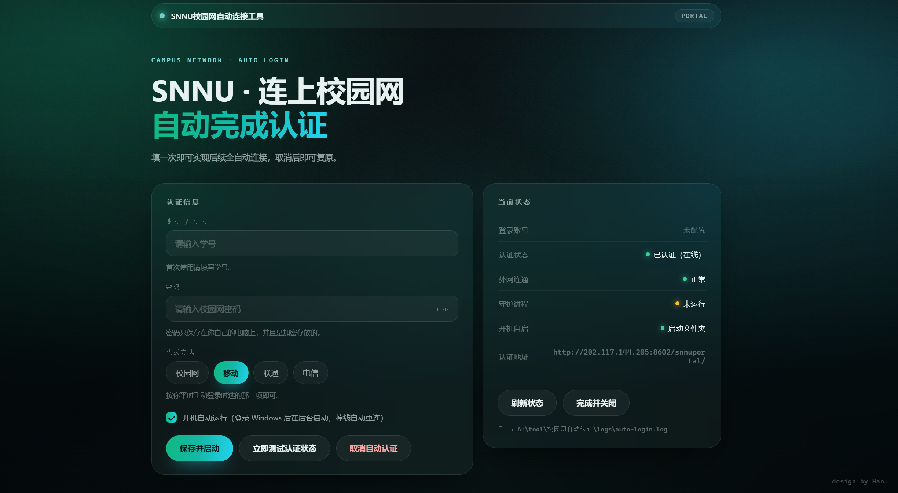

# 校园网自动认证小工具

针对**陕西师范大学校园网 Portal**（`202.117.144.205`，Dr.COM / 深澜架构的 `snnuportal`）编写，
连上校园网后自动完成认证，并**自动选择"移动代拨"**，从此不用再手动打开网页、输账号密码、点代拨。

## 一、快速开始（三步）

1. 双击 **`1.点我开始运行，不要点其他文件！.bat`**，浏览器会自动打开一个配置页面。

    

2. 在页面上填写：
   - **账号 / 学号**
   - **密码**（保存时用 Windows DPAPI 加密，只有你这台电脑的这个用户能解开）
   - **代拨方式**：平时手动登录选哪项就点哪项（校园网 / 移动 / 联通 / 电信），移动用户点"移动"
   - 勾选"开机自动运行"
3. 点 **保存并启动**。页面右侧会实时显示认证状态、外网连通、守护进程、开机自启。

页面上另外两个按钮：

- **立即测试认证状态**：用当前填写（或已保存）的账号密码试一次认证，只报告结果，不改动配置；
- **取消自动认证**：等同于 `3.bat`——停止守护进程 + 取消开机自启 + 断开当前网络登录。

不想等下次开机才生效的话，也可以双击 `2.vbs` 立刻在后台跑起来。
习惯命令行的同学，可以用 `6.bat` 走原来的问答式配置。

## 二、文件说明

| 文件 | 作用 |
| --- | --- |
| `校园网自动认证.ps1` | 主程序（所有功能都在这里） |
| `1.点我开始运行，不要点其他文件！.bat` | **图形配置界面**（浏览器打开，填账号密码和代拨） |
| `ui\index.html` | 配置界面的页面（玻璃拟态风格，仅本地访问） |
| `2.vbs` | 静默启动守护进程（无窗口） |
| `3.bat` | **一键全关**：停止守护进程 + 取消开机自启 + 断开当前网络登录 |
| `4.bat` | 查看当前是否已认证、外网是否通 |
| `5.bat` | 注册开机自启（计划任务不行时自动改用"启动文件夹"） |
| `6.bat` | 问答式配置（不习惯用浏览器时用） |
| `config.json` | 配置（账号、加密后的密码、代拨方式、巡检间隔） |
| `logs\auto-login.log` | 运行日志，出问题时看这里 |

> **1 号是唯一入口**：平时只要双击 `1.点我开始运行，不要点其他文件！.bat`，
> 启动/停止/查状态/开关自启都在界面按钮里完成。
> 2~6 号文件**故意只保留数字名字**（不写中文说明），免得别人随手乱点。
> 对应关系就按上表：2 启动、3 全关、4 查状态、5 开自启、6 命令行配置。
> 2 号保留 `.vbs` 后缀是有意的——只有它能让守护进程无窗口静默启动，改成 `.bat` 会闪一下黑框。

## 三、命令行用法

在 PowerShell 里执行：

```powershell
.\校园网自动认证.ps1 -Action UI          # 打开图形配置界面（本地网页）
.\校园网自动认证.ps1 -Action Setup       # 首次配置
.\校园网自动认证.ps1                     # 守护运行（等价于 -Action Run）
.\校园网自动认证.ps1 -Action Run -Once   # 只跑一轮，适合排错
.\校园网自动认证.ps1 -Action Login       # 立刻认证一次
.\校园网自动认证.ps1 -Action Status      # 查看状态
.\校园网自动认证.ps1 -Action Logout      # 主动断开（测试用）
.\校园网自动认证.ps1 -Action Diagnose    # 抓取登录页并打印解析结果
.\校园网自动认证.ps1 -Action Install     # 注册开机自启
.\校园网自动认证.ps1 -Action Uninstall   # 取消开机自启
.\校园网自动认证.ps1 -Action Stop        # 停止后台守护
.\校园网自动认证.ps1 -Action SelfTest    # 解析逻辑自检（不联网）
```

## 四、工作原理

1. **判定在线状态**：请求 `http://202.117.144.205:8602/snnuportal/login.jsp`。
   已认证时门户会 302 到 `userstatus.jsp`；未认证时返回登录页 —— 以此判断，不依赖任何第三方网站。
2. **解析登录表单**：从登录页 HTML 里读出 `<form>` 的 `action`、隐藏字段、以及"代拨"单选组
   （`yys`：移动 = `mobile`、联通 = `unicom`、电信 = `telecom`、校园网 = 空），门户改版后一般不用改代码。
3. **提交认证**：按门户页面给出的地址 POST `account` / `password` / `yys`，并按 GB2312 编码
   （与老门户一致）；若页面解析不到表单，会用内置候选地址 `login`、`login.jsp` 兜底。
4. **确认结果**：提交后若被送到 `userstatus.jsp` 即视为成功，随后再验证一次外网连通性。
5. **持续守护**：在线时每 45 秒巡检一次；掉线时每 10 秒重试，连续失败会自动退避，避免刷请求。
6. **防止多开**：用全局互斥量保证同一时间只有一个守护进程。

## 五、常见问题

**Q：电脑换到别的地方（不在校园网）会不会一直报错？**
不会刷屏。门户不可达时只记录一条日志，并自动把重试间隔拉长（最长 5 分钟一次），不影响正常上网。

**Q：换了 Windows 用户或重装系统后认证失败？**
密码用 DPAPI 按当前用户加密，换用户后无法解密。重新双击 `1.点我开始运行，不要点其他文件！.bat` 填一次密码即可。

**Q：怎么确认它真的在工作？**
双击 `4.bat`，或查看 `logs\auto-login.log`，每次自动认证都有记录。

**Q：为什么打开配置界面看不到我的账号？**
出于隐私考虑，界面既不回显账号原文、也不预填密码，只在"登录账号"一栏显示掩码（例如 `20******`）。
要换账号就直接在输入框里填新学号；**留空表示沿用已保存的账号**。想看完整账号，打开 `config.json` 即可。

**Q：怎么彻底关掉？关掉之后还会自动连吗？**
双击 `3.bat` 一步到位，它会依次做三件事：

1. 停止后台守护进程 —— 之后掉线不会再自动认证；
2. 取消开机自启 —— 下次开机不会自动运行；
3. 断开当前网络登录 —— 上网会被拦回认证页面，需要手动登录。

执行完会打印每一步的结果（含"开机自启当前状态"），并且断开是否真的生效会向门户确认一次。
实测效果：断开前门户 `online`、www.baidu.com 正常返回；断开后门户 `offline`、访问 www.baidu.com
会被拦截跳转到认证页。

如果你只想"停掉自动重连"但保持当前上网不断（比如只是暂时不想让它接管），命令行执行
`.\校园网自动认证.ps1 -Action Stop` 即可，它不会断开你的当前登录。

**Q：想改成联通 / 电信 / 校园网？**
重新打开 `1.点我开始运行，不要点其他文件！.bat`，在"代拨方式"里点对应那一项，保存即可。

**Q：提示"注册自启失败：拒绝访问"怎么办？**
这是普通用户没有权限在 Windows 计划任务的根目录建任务——和工具本身无关，认证功能照常可用。
现在工具会自动改用**启动文件夹**方式（`%APPDATA%\Microsoft\Windows\Start Menu\Programs\Startup`
下的一个快捷方式），不需要管理员权限，登录后同样自动在后台运行。
如果之前失败过，双击 `5.bat` 重新注册一次即可；想检查是否已注册，看 `4.bat`
里的"开机自启"一行。想用回计划任务的话，右键"以管理员身份运行" `5.bat`。

**Q：手动登录时选"移动"会弹一个广告弹窗，要手动点"确认"才能连上，工具会卡在这里吗？**
不会，不用管它。那个弹窗是登录页里的一段前端 JS（弹的是 `yidong.jpg` 移动促销图），
点"确认"之后它做的事情就是 `$('form').submit()`，不会附加任何隐藏字段、也不与服务器交互。
本工具是直接按接口提交表单、完全不渲染页面，所以这个弹窗在自动认证流程里不会出现。
（那段提示里提到"移动校园网体验活动将于 9 月 28 日结束"，若哪天移动代拨突然登不上，可以先确认是不是套餐到期。）

**Q：出问题了怎么排查？**
在离线状态下执行 `.\校园网自动认证.ps1 -Action Diagnose`，它会保存登录页并打印解析出的
`action`、字段名和代拨取值，把输出发我即可定位。

## 六、注意

- 密码以 DPAPI 加密存放在 `config.json`，不要把这个文件连同电脑一起借给别人。
- 所有 `.bat` / `.vbs` 启动器**刻意只用纯 ASCII 内容**（中文提示一律由 PowerShell 脚本输出），
  这样无论控制台代码页是什么，都不会再出现"中文路径乱码导致脚本根本没执行"的问题。
- 改代码时注意：`校园网自动认证.ps1` **必须保存为「UTF-8 带 BOM」**。脚本里有大量中文提示与注释，
  而 Windows PowerShell 5.1 读不带 BOM 的 UTF-8 脚本会按 GBK 解码，直接语法报错。
  `.gitattributes` 已把 `.bat` / `.vbs` 固定成 CRLF 行尾，正是为了让 cmd.exe 稳定执行。
- **给文件改名之前先看这条**：
  - `1.bat / 3.bat / 4.bat / 5.bat / 6.bat` 随便改名都不影响运行——它们靠文件夹里的 `*.ps1`
    定位脚本，不看自己的名字（后缀 `.bat` 必须保留，否则双击打不开）。
  - `2.vbs` 改名后，要再双击一次 `5.bat` 重新注册开机自启：自启快捷方式里记的是它的**绝对路径**，
    不重注册会静默失效。
  - 整个文件夹改名或移动后，同样重新双击一次 `5.bat` 即可（`config.json` 和 `logs\` 会跟着走，配置不丢）。
  - 同一个文件夹里不要放第二个 `.ps1`，否则启动器可能挑错脚本。
- 想把这个工具发给同学用的话，请先删掉 `config.json` 和 `logs\` 两个东西：
  前者存着你自己的学号和加密后的密码，后者是运行记录。删掉后对方第一次运行会重新配置。
- 如果学校门户改版（换域名 / 端口 / 字段名），工具会先尝试自适应；实在对不上时执行一次
  `-Action Diagnose` 就能看出差在哪里。
